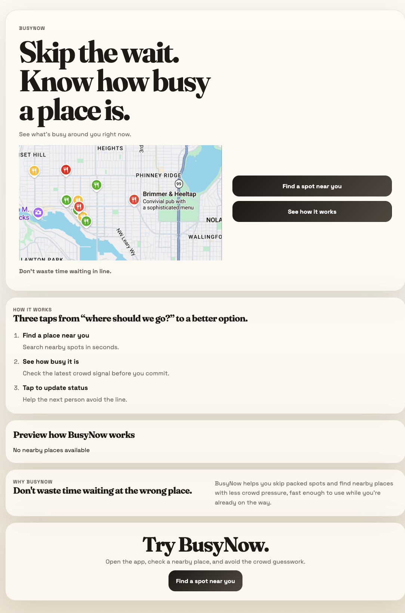
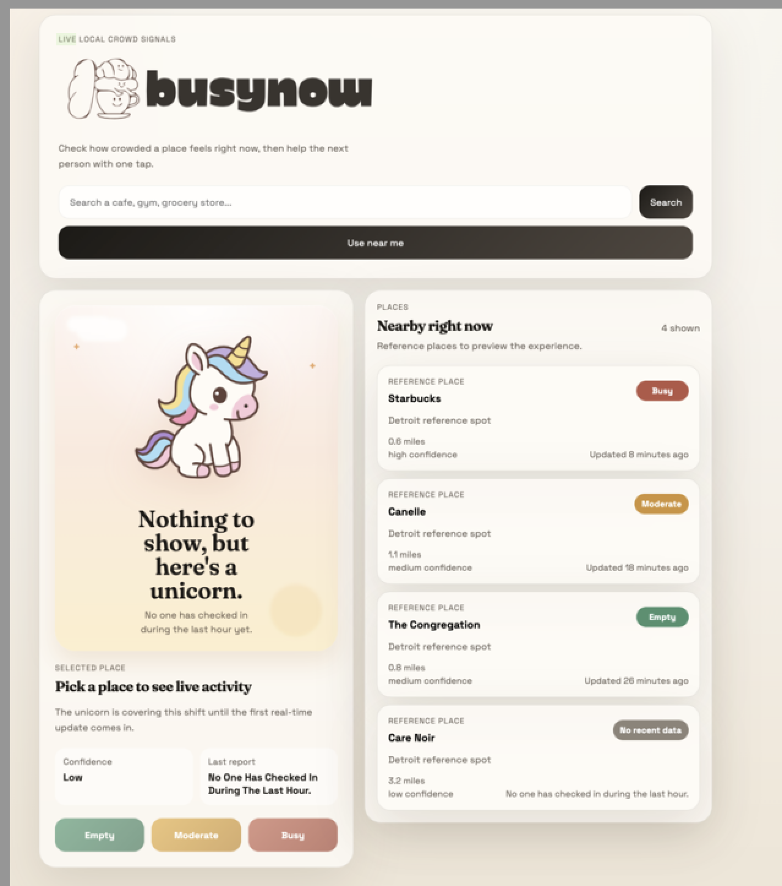

# BusyNow

BusyNow is a crowd visibility app for discovering nearby places, checking current crowd signals, and submitting one-tap updates without creating an account.

Live app:

- Frontend: [https://busynow.app](https://busynow.app)
- BusyNow is only available in select Seattle Neighborhoods and Lower Manhattan. If you see an API error, that's the WAF blocking you ;)

## At A Glance

- Product: real-time crowd visibility for nearby places
- Frontend: React served through CloudFront
- Backend: Express on ECS Fargate behind an ALB
- Infrastructure: Terraform on AWS
- Delivery: GitHub Actions with AWS OIDC
- Focus: platform engineering, SRE, and production operations

## Why This Is More Than An App

BusyNow is intentionally small at the product layer and deeper at the systems layer.

The interesting part is not just that a user can search for nearby places. The interesting part is the operating model around that user flow:

- how traffic is routed and protected at the edge
- how deploys are authenticated, promoted, and rolled back
- how third-party API usage affects reliability and cost
- how infrastructure decisions trade simplicity against safety
- how a modest service is made observable and operable over time

## What BusyNow Does

- Finds nearby places around a user’s location
- Lets users search for a place and load nearby results
- Shows lightweight crowd signals like `empty`, `moderate`, and `busy`
- Accepts fast crowd check-ins without login friction
- Uses cloud infrastructure on AWS with edge security and deployment automation

## Why This Project Exists

BusyNow is both:

- a real product I want to ship publicly
- a hands-on platform engineering and SRE portfolio project

The app itself is intentionally lightweight. The deeper value is in how it is operated:

- infrastructure as code
- secure edge routing
- containerized backend delivery
- static frontend deployment
- GitHub Actions automation
- rollback planning
- cost and abuse controls around third-party APIs

## Platform Highlights

- Frontend hosted on S3 + CloudFront
- Backend running on ECS Fargate behind an ALB
- Infrastructure managed with Terraform
- GitHub Actions for CI/CD
- AWS OIDC for GitHub-to-AWS authentication
- WAF and edge controls to reduce abusive traffic
- Secrets Manager for sensitive runtime configuration

## Engineering Principles

- Prefer reversible changes over clever changes
- Keep the runtime simple and move complexity to documented control planes
- Protect expensive dependencies at the edge before they become an app problem
- Use immutable artifacts and explicit promotion instead of rebuilding on the fly
- Treat cost as a first-class production constraint
- Add complexity only when it clearly improves safety, reliability, or operator confidence

## Public Documentation

- [Platform Engineering Roadmap](platform-roadmap.md)
- [System Architecture](architecture.md)
- [Engineering Principles And Tradeoffs](engineering-principles.md)
- [Operating BusyNow: Notes and Lessons](operating-busynow.md)
- [Screenshots Guide](screenshots/README.md)

## Screenshots

### Landing page

Current public landing page:

### First live API day

Early app view from the first day BusyNow was live with the API connected:

## Current Focus

The next phase of BusyNow is less about adding app features and more about improving operational maturity:

- observability
- service-level objectives
- safer deployment workflows
- rollback drills
- cost visibility
- incident runbooks

See the public roadmap:

- [Platform Engineering Roadmap](platform-roadmap.md)

## Public Notes

The implementation repository may remain private while this public documentation stays shareable. That lets me discuss:

- product direction
- system architecture
- engineering tradeoffs
- reliability strategy
- deployment design
- lessons learned

without exposing the source code itself.
