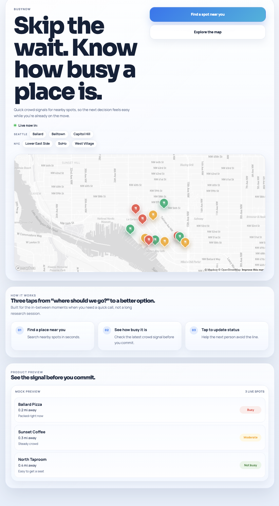
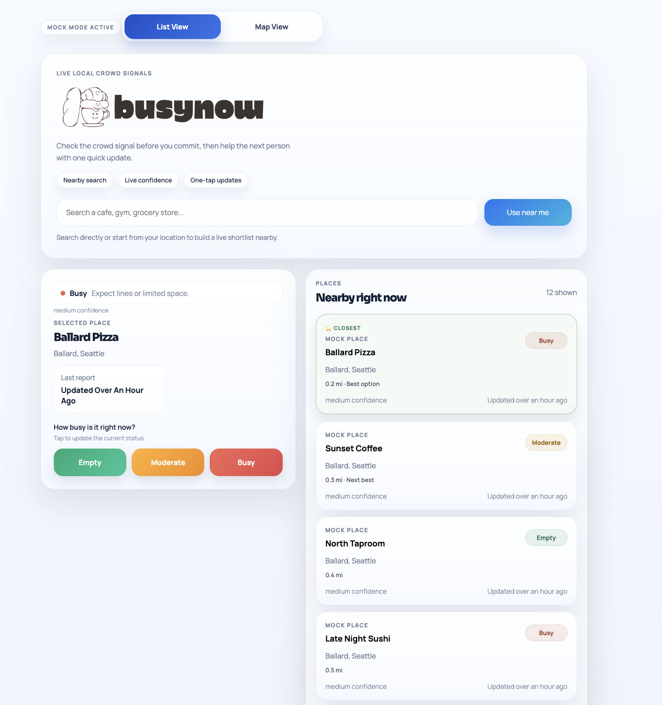
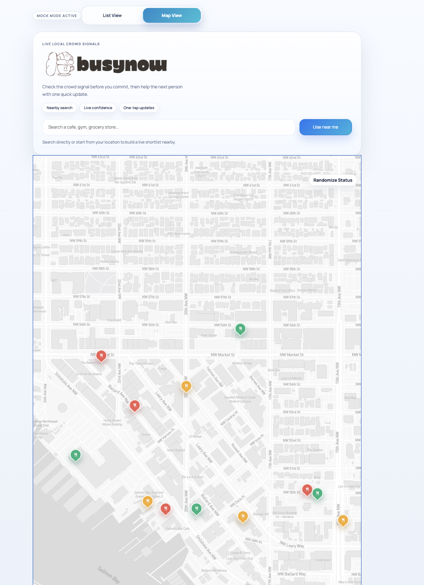

# BusyNow

BusyNow is a production crowd-visibility application for discovering nearby places, checking current crowd signals, and submitting one-tap updates without creating an account.

Live app:

- Frontend: [https://busynow.app](https://busynow.app)

Infrastructure note:

- `busynow.app` is backed by the production AWS stack
- protected API traffic follows `CloudFront -> ALB ingress -> Amazon EKS`
- development infrastructure is ephemeral and remains torn down by default

## At A Glance

- Product: lightweight crowd visibility for nearby places
- Frontend: React and Vite assets served through CloudFront and S3
- Backend: Express on Amazon EKS behind an ALB ingress and Kubernetes `Service`
- Edge model: CloudFront is the only public entry point
- Routing: explicit CloudFront behaviors for `/places*`, `/api/places*`, `/status*`, `/api/status*`, `/checkin*`, and `/api/checkin*`
- Delivery: immutable ECR images, Helm, Argo CD, GitHub Actions, and AWS OIDC
- Scaling: HPA for pod replicas and Karpenter for elastic node capacity
- Coordination: anonymous browser IDs plus Redis-backed check-in dedupe
- Persistence: optional Postgres or Supabase depending on environment and runtime configuration
- Observability: selective structured usage and check-in event logs in CloudWatch
- Infrastructure: Terraform-managed AWS resources with Git-managed Kubernetes configuration

## Current Live Behavior

- the browser stores a stable anonymous UUID in `localStorage` under `bn_user_id`
- every browser `fetch` request includes `x-bn-user-id`
- that ID is used for lightweight telemetry and Redis-backed duplicate check-in suppression, not auth
- BusyNow emits structured single-line `[USAGE_EVENT]` logs only for `/places*` and `/checkin*`
- BusyNow emits structured single-line `[CHECKIN_EVENT]` logs for check-in `created` and `updated` actions
- Redis stores TTL-backed `checkin:{place_id}:{user_id}` coordination keys for 30 minute cooldown dedupe
- if Redis is unavailable, the API degrades safely and continues instead of crashing

## Why This Is More Than An App

BusyNow is intentionally small at the product layer and deeper at the systems layer.

The interesting part is not only that a user can search for nearby places. The interesting part is the operating model around that flow:

- how traffic is routed and protected at the edge
- how GitOps keeps the live Kubernetes workload aligned with reviewed configuration
- how browser-facing `/places/*` and CLI-friendly `/api/places/*` intentionally behave differently
- how third-party API usage affects reliability and cost
- how anonymous browser IDs and selective telemetry stay useful without adding auth
- how lightweight distributed coordination is added without turning Redis into a general cache

## What BusyNow Does

- Finds nearby places around a user location
- Lets users search for a place and load nearby results
- Shows lightweight crowd signals like `empty`, `moderate`, and `busy`
- Accepts fast crowd check-ins without login friction
- Uses anonymous browser IDs for telemetry and repeat check-in dedupe only
- Routes protected API traffic through CloudFront, the ALB ingress, and EKS
- Protects the browser-facing `/places/*` path more aggressively because it can trigger paid Google Places traffic

## Platform Highlights

- CloudFront is the only public entry point
- S3 serves the frontend origin and SPA fallback path
- the live backend runs on Amazon EKS behind an ALB ingress
- CloudFront injects `x-internal-key` on backend origin requests
- the backend ingress only forwards approved API paths when that internal header matches
- direct ALB access is blocked before listener evaluation by the current security posture
- Redis provides TTL-backed check-in dedupe coordination across EKS pods
- CloudWatch Logs and Insights provide structured operational visibility
- Helm and Argo CD provide reviewable, declarative backend delivery
- HPA and Karpenter separate application scaling from worker-node capacity

## Public Documentation

- [Current Live Architecture](architecture.md)
- [Protected API Routing](api-routing.md)
- [WAF API Behavior](waf-api-behavior.md)
- [Redis Check-In Coordination](redis-architecture.md)
- [Dependency Inventory](dependency-inventory.md)
- [Load Test Notes](load-test-notes.md)
- [Reliability Controls](reliability-controls.md)
- [Runbook Coverage Index](runbook-index.md)
- [Engineering Principles And Tradeoffs](engineering-principles.md)
- [Operating BusyNow](operating-busynow.md)
- [Platform Engineering Roadmap](platform-roadmap.md)
- [Screenshots Guide](screenshots/README.md)

## Product Preview

The current interface is shown with deterministic MockMode data so the complete product flow can be demonstrated without generating paid upstream API traffic or exposing user activity.

### Landing And Product Overview

The landing experience introduces the crowd-signal workflow, supported neighborhoods, live map preview, and three-step product model.

### List And Check-In View

The desktop workspace keeps the selected place, latest signal, one-tap update controls, and nearby results visible together.

### Map View

The map workspace uses the same live crowd-signal states for geographic discovery and quick comparison.

## Current Focus

The next phase of BusyNow is less about inventing first-time operations work and more about extending the current live operating model:

- routine SLO and error-budget review
- repeatable post-deploy smoke checks for `/api/places/*`, `/status*`, and `/checkin*`
- rollback and failure-recovery drills for the EKS path
- more CloudWatch dashboards and saved Insights queries
- stronger GitOps drift detection and deployment verification
- externalized Kubernetes secret management
- continued abuse and cost control around Google Places traffic

## Public Notes

The implementation repository remains private while this public documentation stays shareable. It presents the current product, live architecture, routing behavior, operational tradeoffs, and reliability model without exposing application source or sensitive infrastructure details.
