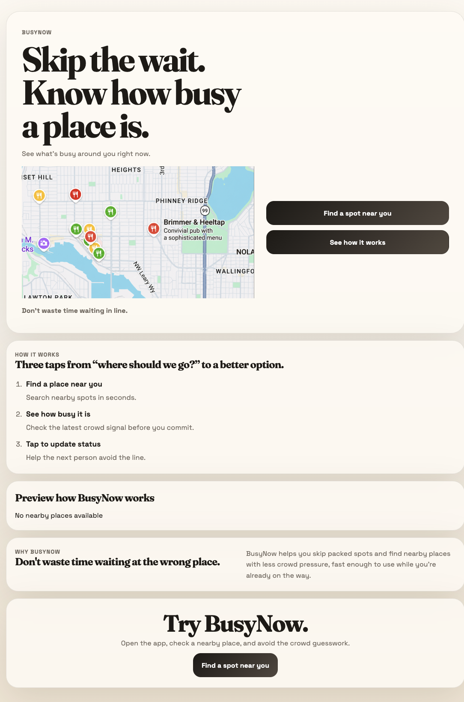
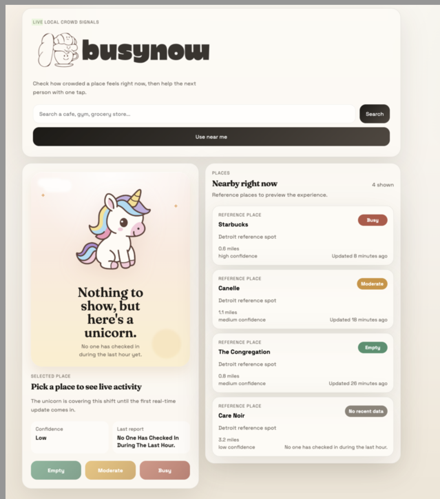

# BusyNow

BusyNow is a live crowd-visibility app for discovering nearby places, checking current crowd signals, and submitting one-tap updates without creating an account.

Live app:

- Frontend: [https://busynow.app](https://busynow.app)

Infrastructure note:

- the current public app is still served from the live `dev` stack
- a separate `prod` Terraform skeleton now exists for the eventual environment split

## At A Glance

- Product: lightweight crowd visibility for nearby places
- Frontend: React served through CloudFront and S3
- Backend: Express on ECS Fargate behind an ALB
- Edge model: CloudFront is the only public entry point
- Routing: explicit CloudFront behaviors for `/places*`, `/api/places*`, `/status*`, `/api/status*`, `/checkin*`, and `/api/checkin*`
- Coordination: anonymous browser IDs plus Redis-backed check-in dedupe
- Persistence: optional Postgres or Supabase depending on environment and runtime configuration
- Observability: selective structured usage and check-in event logs in CloudWatch
- Delivery: GitHub Actions with AWS OIDC and Terraform-managed infrastructure

## Current Live Behavior

- the browser stores a stable anonymous UUID in `localStorage` under `bn_user_id`
- every browser `fetch` request includes `x-bn-user-id`
- that ID is used for lightweight telemetry and Redis-backed duplicate check-in suppression, not auth
- BusyNow emits structured single-line `[USAGE_EVENT]` logs only for `/places*` and `/checkin*`
- BusyNow emits structured single-line `[CHECKIN_EVENT]` logs for check-in `created` and `updated` actions
- Redis stores TTL-backed `checkin:{place_id}:{user_id}` coordination keys for 30 minute cooldown dedupe
- if Redis is unavailable, the API degrades safely and continues instead of crashing

## Why This Is More Than An App

BusyNow is intentionally small at the product layer and deeper at the systems layer.

The interesting part is not only that a user can search for nearby places. The interesting part is the operating model around that flow:

- how traffic is routed and protected at the edge
- how browser-facing `/places/*` and CLI-friendly `/api/places/*` intentionally behave differently
- how third-party API usage affects reliability and cost
- how anonymous browser IDs and selective telemetry stay useful without adding auth
- how lightweight distributed coordination is added without turning Redis into a general cache
- how a modest service is made observable and operable over time

## What BusyNow Does

- Finds nearby places around a user location
- Lets users search for a place and load nearby results
- Shows lightweight crowd signals like `empty`, `moderate`, and `busy`
- Accepts fast crowd check-ins without login friction
- Uses anonymous browser IDs for telemetry and repeat check-in dedupe only
- Routes protected API traffic through CloudFront, the ALB, and ECS
- Protects the browser-facing `/places/*` path more aggressively because it can trigger paid Google Places traffic

## Platform Highlights

- CloudFront is the only public entry point
- S3 serves the frontend origin and SPA fallback path
- the ALB origin is used only for explicit API path families
- CloudFront injects `x-internal-key` on backend origin requests
- the ALB only forwards approved API paths when that internal header matches
- direct ALB access is blocked before listener evaluation by the current security posture
- Redis provides TTL-backed check-in dedupe coordination across ECS tasks
- CloudWatch Logs and Insights provide structured operational visibility
- AWS Secrets Manager supplies runtime secrets

## Public Documentation

- [Current Live Architecture](architecture.md)
- [Protected API Routing](api-routing.md)
- [WAF API Behavior](waf-api-behavior.md)
- [Redis Check-In Coordination](redis-architecture.md)
- [Dependency Inventory](dependency-inventory.md)
- [Load Test Notes](load-test-notes.md)
- [Reliability Controls](reliability-controls.md)
- [Runbook Coverage Index](runbook-index.md)
- [Engineering Principles And Tradeoffs](engineering-principles.md)
- [Operating BusyNow](operating-busynow.md)
- [Platform Engineering Roadmap](platform-roadmap.md)
- [Screenshots Guide](screenshots/README.md)

## Screenshots

### Landing page

Current public landing page:

### First live API day

Early app view from the first day BusyNow was live with the API connected:

## Current Focus

The next phase of BusyNow is less about inventing first-time operations work and more about extending the current live operating model:

- routine SLO and error-budget review
- repeatable post-deploy smoke checks for `/api/places/*`, `/status*`, and `/checkin*`
- rollback drills
- more CloudWatch dashboards and saved Insights queries
- better separation between the live `dev` stack and future `prod`
- continued abuse and cost control around Google Places traffic

## Public Notes

The implementation repository may remain private while this public documentation stays shareable. That lets the system design, routing behavior, operational tradeoffs, and reliability model stay visible without exposing the source code itself.
