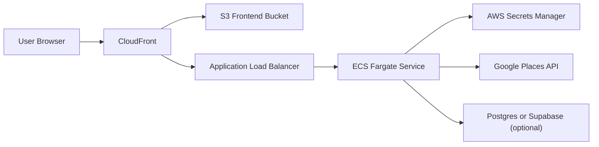

# BusyNow Architecture

BusyNow is intentionally a small application with a real production delivery and edge-security footprint.

## High-Level Flow

## Frontend Path

- Static assets are stored in S3
- CloudFront serves `https://busynow.app`
- The landing page and app shell are delivered from the S3 origin
- CloudFront invalidation is used after frontend deploys

## API Path

- CloudFront routes `/places/*` to the backend origin
- The ALB sits in front of the ECS service
- The backend runs in ECS Fargate as a containerized Express service
- Nearby search depends on Google Places

## Edge Security Model

- CloudFront forwards a protected internal header to the ALB
- The ALB only forwards protected traffic to the backend path
- WAF rules and rate limits help reduce abusive traffic
- Direct origin access is intentionally tightened

## Delivery Model

### Frontend

- GitHub Actions builds the Vite frontend
- Build artifacts are synced to S3
- A CloudFront invalidation refreshes the edge cache

### Backend

- GitHub Actions builds a Docker image
- The image is pushed to ECR with immutable tags
- ECS deploys explicit image tags instead of relying on `latest`
- Rollback is based on known-good task definitions or image tags

## Why These Choices

### CloudFront + S3 For The Frontend

This keeps the frontend delivery model simple, cheap, and easy to invalidate globally after a release.

### ECS Fargate For The Backend

This provides a managed container runtime without taking on Kubernetes complexity too early. It is a pragmatic fit for a small service that still needs real deployment and runtime discipline.

### ALB In Front Of ECS

The ALB provides a clear control point for routing, health checks, and origin protection. It also keeps the backend service model understandable for troubleshooting and rollout work.

### Terraform For Infrastructure

The goal is not just reproducibility. The goal is making infrastructure decisions reviewable, repeatable, and explainable over time.

## Configuration And Secrets

- GitHub Actions authenticates to AWS with OIDC
- Runtime secrets are stored in AWS Secrets Manager
- Backend dependencies like Google Places are injected at runtime

## Architecture Tradeoffs

### What This Optimizes For

- operator clarity
- controlled delivery
- cloud-managed primitives
- cost awareness around third-party API traffic

### What This Does Not Yet Optimize For

- multi-region resilience
- high-throughput global scale
- zero-downtime advanced rollout patterns everywhere
- deep platform self-service for other teams

## Evolution Path

The intended progression is:

1. keep the runtime understandable
2. improve observability and reliability controls
3. add stronger environment promotion and rollout safety
4. add complexity only when the operational payoff is clear

## Why This Architecture Matters

The point of BusyNow is not just to show a React app talking to an API. It is to show:

- edge routing decisions
- container-based deployment
- infrastructure as code
- delivery automation
- abuse prevention
- operational tradeoffs around third-party APIs and cloud cost
