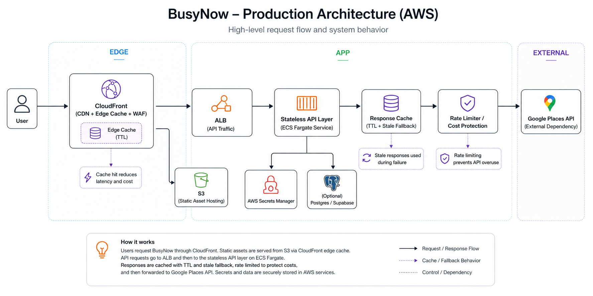

# BusyNow Architecture

BusyNow is a small web application with separate frontend and backend delivery, AWS-hosted infrastructure, and protection around the most expensive API paths.

## High-Level Flow

## Frontend Path

- static assets are stored in S3
- CloudFront serves `https://busynow.app`
- the landing page and app shell are delivered from the S3 origin
- frontend releases use CloudFront invalidation to refresh cached assets

## API Path

- CloudFront routes `/places/*` to the backend origin
- the ALB sits in front of the ECS service
- the backend runs in ECS Fargate as a containerized Express service
- nearby search depends on Google Places
- place status is derived from recent BusyNow check-ins

## Edge Security Model

- CloudFront forwards a protected internal header to the backend origin
- the backend path is designed to reject direct requests that do not match the expected internal protection
- WAF rules and rate limits help reduce abusive traffic
- the API path receives stricter protection than the static frontend path because it is the most expensive runtime surface

## Delivery Model

### Frontend

- GitHub Actions builds the Vite frontend
- build artifacts are synced to S3
- CloudFront invalidation refreshes the public cache after release

### Backend

- GitHub Actions builds a Docker image
- the image is pushed to ECR with immutable tags
- ECS deploys explicit image tags instead of relying on `latest`
- rollback uses known-good task definitions or known-good image tags

## Main Infrastructure Choices

### CloudFront + S3 For The Frontend

This keeps frontend delivery simple and inexpensive while making it easy to publish static assets globally.

### ECS Fargate For The Backend

This provides a managed container runtime without adding orchestration complexity that the service does not yet need.

### ALB In Front Of ECS

The ALB provides a clear control point for request routing, health checks, and backend access protection.

### Terraform For Infrastructure

Terraform keeps infrastructure changes reviewable, repeatable, and easier to understand over time.

## Configuration And Secrets

- GitHub Actions authenticates to AWS with OIDC
- runtime secrets are stored in AWS Secrets Manager
- backend dependencies like Google Places are injected at runtime

## Current Tradeoffs

### What The Architecture Optimizes For

- operational clarity
- controlled delivery
- cloud-managed infrastructure primitives
- cost awareness around paid third-party API traffic

### What The Architecture Does Not Yet Optimize For

- multi-region resilience
- high-throughput global scale
- advanced zero-downtime rollout patterns everywhere
- generalized self-service platform tooling

## Planned Evolution

The intended progression is:

1. keep the runtime understandable
2. improve observability and reliability controls
3. separate environments more cleanly
4. add more rollout and recovery safety where it is justified

## Related Documents

- [Implementation Roadmap](platform-roadmap.md)
- [Engineering Principles And Tradeoffs](engineering-principles.md)
- [Operating BusyNow](operating-busynow.md)
