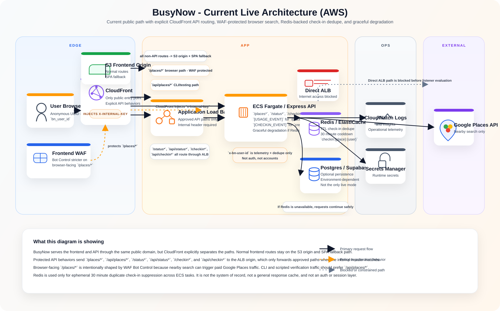

# BusyNow Architecture

BusyNow is a small AWS-hosted web application with separate frontend and backend delivery, explicit edge routing, lightweight distributed coordination for check-ins, and selective operational telemetry.

The current public app is still served from the live `dev` stack. A separate `prod` Terraform skeleton now exists, but it is not yet the live traffic path.

## BusyNow - Current Live Architecture (AWS)

Caption:
CloudFront uses explicit API behaviors for `/places/*`, `/api/places/*`, `/status*`, `/api/status*`, `/checkin*`, and `/api/checkin*`; `/places/*` is additionally shaped by frontend WAF Bot Control; Redis provides 30 minute check-in dedupe coordination; and the API degrades safely when Redis is unavailable.

## Current Request Flow

- CloudFront is the only public entry point
- normal frontend routes continue to the S3 origin and SPA fallback
- explicit API path families route to the backend ALB origin
- CloudFront injects `x-internal-key` on API origin requests
- the ALB only forwards approved API path families when that internal header matches
- direct ALB access is not the public path and is blocked before listener evaluation by the current security posture

## Anonymous Browser IDs

- the frontend persists a stable anonymous UUID in `localStorage` under `bn_user_id`
- every browser `fetch` request includes `x-bn-user-id`
- BusyNow uses that value for lightweight telemetry and Redis-backed check-in dedupe only
- this is not auth and not a user account system

## Telemetry And Event Logging

- `[USAGE_EVENT]` is emitted only for business-relevant `/places*` and `/checkin*` routes
- noisy routes like `/health` are intentionally excluded
- the structured payload includes `type`, `method`, `path`, `user_id`, `neighborhood`, and `timestamp`
- `[CHECKIN_EVENT]` is emitted for check-in `created` and `updated` actions with `place_id`, `user_id`, and `timestamp`

## Redis Coordination

- Redis is used as ephemeral shared coordination state across ECS tasks
- the key format is `checkin:{place_id}:{user_id}`
- each key stores JSON and uses a 30 minute TTL (`1800` seconds)
- the first check-in for the same `place_id + user_id` returns `checkin_action: "created"`
- a repeat check-in during the cooldown refreshes the TTL and returns `checkin_action: "updated"`
- Redis is not the source of truth for crowd status
- Redis is not a general shared response cache
- Redis is not a session or auth layer

## `/places/*` vs `/api/places/*`

- `/status` and `/checkin` reach the backend correctly through `CloudFront -> ALB -> ECS`
- `/api/places/*` also reaches the backend correctly
- `/places/*` may appear to fall through to the SPA when tested with `curl` or HTTP-library clients
- that is not a CloudFront routing defect
- the live routing is correct; the differing behavior is caused by frontend WAF Bot Control enforcement on `/places/*`
- the intended usage model is browser traffic on `/places/*` and CLI or scripted verification traffic on `/api/places/*`

## Related Documents

- [Protected API Routing](api-routing.md)
- [WAF API Behavior](waf-api-behavior.md)
- [Redis Check-In Coordination](redis-architecture.md)
- [Reliability Controls](reliability-controls.md)
- [Operating BusyNow](operating-busynow.md)
- [Platform Engineering Roadmap](platform-roadmap.md)
