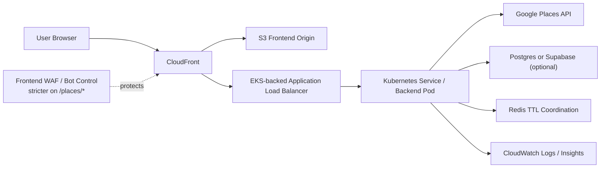

# BusyNow Architecture

BusyNow is a small AWS-hosted web application with separate frontend and backend delivery, explicit edge routing, lightweight distributed coordination for check-ins, and selective operational telemetry.

The current public app is still served from the live `dev` stack. A separate `prod` Terraform skeleton now exists, but it is not yet the live traffic path.

## BusyNow - Current Live Architecture (AWS)

```mermaid
flowchart LR
    U["User Browser"] --> CF["CloudFront"]
    WAF["Frontend WAF / Bot Control<br/>stricter on /places/*"] -. protects .-> CF

    CF --> S3["S3 Frontend Origin"]
    CF --> ALB["EKS-backed Application Load Balancer"]
    ALB --> K8S["Kubernetes Service / Backend Pod"]
    K8S --> GP["Google Places API"]
    K8S --> DB["Postgres or Supabase (optional)"]
    K8S --> R["Redis TTL Coordination"]
    K8S --> CW["CloudWatch Logs / Insights"]
```

Caption:
CloudFront uses explicit API behaviors for `/places/*`, `/api/places/*`, `/status*`, `/api/status*`, `/checkin*`, and `/api/checkin*`; `/places/*` is additionally shaped by frontend WAF Bot Control; Redis provides 30 minute check-in dedupe coordination; and the API degrades safely when Redis is unavailable.

## Frontend Path

- static assets are stored in S3
- CloudFront serves `https://busynow.app`
- the landing page and app shell are delivered from the S3 origin
- frontend releases use CloudFront invalidation to refresh cached assets
- the browser persists an anonymous UUID in `localStorage` and forwards it as `x-bn-user-id` on API requests

## API Path

- CloudFront routes `/places/*`, `/api/places/*`, `/status*`, `/api/status*`, `/checkin*`, and `/api/checkin*` to the backend origin
- the live backend origin is an ALB managed for the EKS ingress path
- the backend runs in Amazon EKS as a containerized Express service
- nearby search depends on Google Places
- place status is derived from recent BusyNow check-ins
- usage telemetry is selectively emitted for `/places*` and `/checkin*`
- repeat check-ins are coordinated through Redis TTL keys so EKS pods share the same cooldown state
- `/api/places/*` remains the better path for CLI and scripted verification traffic when `/places/*` browser protections intentionally block HTTP-library clients
- the legacy ECS service is scaled to `0` and retained only as a warm rollback path during the current soak

## Edge Security Model

- CloudFront forwards a protected internal header to the backend origin
- the ALB listener rules only forward approved API path families when that internal header matches
- the backend path is designed to reject direct requests that do not match the expected internal protection
- WAF rules and rate limits help reduce abusive traffic
- the API path receives stricter protection than the static frontend path because it is the most expensive runtime surface
- non-API routes still fall through to the frontend S3 origin and SPA fallback
- frontend WAF Bot Control is intentionally stricter on `/places/*` than on `/api/places/*`

## Operational Bulkheads

### Paid Upstream Bulkhead

- nearby search is the only path that can directly trigger Google Places lookups
- that path is protected more aggressively at the edge than the rest of the app
- cached or degraded responses are preferred over uncontrolled upstream spend during failure

### Coordination Bulkhead

- BusyNow uses Redis only for ephemeral coordination, not as the source of truth for crowd status
- repeated check-ins from the same user and place refresh a 30 minute TTL instead of creating duplicate durable writes
- if Redis is unavailable, the API stays up and falls back safely instead of crashing check-in requests

### Release Bulkhead

- frontend and backend are deployed independently
- frontend delivery uses immutable artifacts and CloudFront invalidation
- backend delivery uses explicit image tags and known-good rollback targets
- the live backend deploy workflow is currently the EKS path documented in the runbooks

### Environment Bulkhead

- the live service still runs from the `dev` stack today
- the `prod` stack is scaffolded for a future environment split
- the intended end state is promotion between environments instead of treating one stack as everything

## Delivery Model

### Frontend

- GitHub Actions builds the Vite frontend
- build artifacts are published once, then synced to S3 for release
- CloudFront invalidation refreshes the public cache after release

### Backend

- GitHub Actions builds a Docker image
- the image is pushed to ECR with immutable tags
- the current live EKS deploy path applies explicit image tags to the Kubernetes `Deployment`
- rollback uses `kubectl rollout undo`, with ECS still available as a short-term soak fallback
- failed verification is designed to trigger rollback instead of leaving a broken release in place

## Main Infrastructure Choices

### CloudFront + S3 For The Frontend

This keeps frontend delivery simple and inexpensive while making it easy to publish static assets globally. CloudFront also provides the explicit ordered behaviors that steer protected API paths to the ALB before the SPA fallback can catch them.

### Amazon EKS For The Backend

This provides the Kubernetes runtime and operational surface BusyNow now uses for the live backend path.

### ALB In Front Of EKS

The ALB provides a clear control point for request routing, health checks, and backend access protection.

### Terraform For Infrastructure

Terraform keeps infrastructure changes reviewable, repeatable, and easier to understand over time.

## Configuration And Secrets

- GitHub Actions authenticates to AWS with OIDC
- the current live EKS backend gets runtime configuration through Kubernetes `ConfigMap` and `Secret` objects
- backend dependencies like Google Places are injected at runtime
- optional runtime coordination like Redis is also injected through environment configuration such as `REDIS_URL`

## Current Runtime Status

BusyNow completed the first CloudFront backend cutover to EKS on May 16, 2026.

- the public app now serves backend traffic through the EKS-backed CloudFront origin
- ECS is scaled to `0` and kept briefly as a warm rollback target during soak
- the old `busynow-alb` is no longer the live public backend origin

## Related Documents

- [Protected API Routing](api-routing.md)
- [WAF API Behavior](waf-api-behavior.md)
- [Redis Check-In Coordination](redis-architecture.md)
- [Reliability Controls](reliability-controls.md)
- [Operating BusyNow](operating-busynow.md)
- [Platform Engineering Roadmap](platform-roadmap.md)
