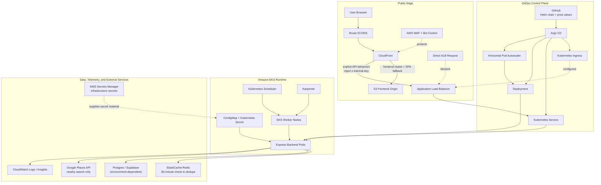

# BusyNow Architecture

BusyNow is a production AWS application with separate frontend and backend delivery, explicit edge routing, Kubernetes-based runtime orchestration, lightweight distributed coordination for check-ins, and selective operational telemetry.

The public application runs on the production stack. Development infrastructure is ephemeral and remains torn down by default.

## BusyNow - Current Live Architecture (AWS)

```mermaid
flowchart TB
    subgraph EDGE["Public Edge"]
        U["User Browser"] --> DNS["Route 53 DNS"]
        DNS --> CF["CloudFront"]
        WAF["AWS WAF + Bot Control"] -. protects .-> CF
        CF -->|"frontend routes + SPA fallback"| S3["S3 Frontend Origin"]
        CF -->|"explicit API behaviors<br/>inject x-internal-key"| ALB["Application Load Balancer"]
        DIRECT["Direct ALB Request"] -. blocked .-> ALB
    end

    subgraph GITOPS["GitOps Control Plane"]
        REPO["GitHub<br/>Helm chart + prod values"] --> ARGO["Argo CD"]
        ARGO --> ING["Kubernetes Ingress"]
        ARGO --> SVC["Kubernetes Service"]
        ARGO --> DEP["Deployment"]
        ARGO --> HPA["Horizontal Pod Autoscaler"]
        ING -. configures .-> ALB
        HPA --> DEP
    end

    subgraph RUNTIME["Amazon EKS Runtime"]
        ALB --> SVC
        SVC --> PODS["Express Backend Pods"]
        DEP --> PODS
        SCHED["Kubernetes Scheduler"] --> NODES["EKS Worker Nodes"]
        KARP["Karpenter"] --> NODES
        NODES --> PODS
        CONFIG["ConfigMap + Kubernetes Secret"] --> PODS
    end

    subgraph DEPS["Data, Telemetry, and External Services"]
        PODS --> REDIS["ElastiCache Redis<br/>30-minute check-in dedupe"]
        PODS --> DB["Postgres / Supabase<br/>(environment-dependent)"]
        PODS --> GP["Google Places API<br/>nearby search only"]
        PODS --> CW["CloudWatch Logs / Insights"]
        SECRETS["AWS Secrets Manager<br/>infrastructure secrets"]
        SECRETS -. supplies secret material .-> CONFIG
    end
```

Caption:
CloudFront is the only public entry point. It serves frontend routes from S3 and forwards explicit API path families to the EKS ingress ALB with an internal origin header. WAF protects the browser-facing search path, Redis coordinates a 30-minute check-in cooldown across pods, and the API degrades safely if Redis is unavailable.

## Frontend Path

- static assets are stored in S3
- Route 53 points `busynow.app` at CloudFront
- CloudFront serves `https://busynow.app`
- the landing page and app shell are delivered from the S3 origin
- frontend releases use CloudFront invalidation to refresh cached assets
- the browser persists an anonymous UUID in `localStorage` and forwards it as `x-bn-user-id` on API requests

## API Path

- CloudFront routes `/places/*`, `/api/places/*`, `/status*`, `/api/status*`, `/checkin*`, and `/api/checkin*` to the backend origin
- the live backend origin is an AWS ALB managed by the Kubernetes ingress path
- the backend runs in Amazon EKS as a containerized Express service behind a Kubernetes `Service`
- nearby search depends on Google Places
- place status is derived from recent BusyNow check-ins
- usage telemetry is selectively emitted for `/places*` and `/checkin*`
- repeat check-ins are coordinated through Redis TTL keys so EKS pods share the same cooldown state
- `/api/places/*` remains the better path for CLI and scripted verification traffic when `/places/*` browser protections intentionally block HTTP-library clients

## Edge Security Model

- CloudFront forwards a protected internal header to the backend origin
- the ALB listener rules only forward approved API path families when that internal header matches
- the backend path is designed to reject direct requests that do not match the expected internal protection
- WAF rules and rate limits help reduce abusive traffic
- the API path receives stricter protection than the static frontend path because it is the most expensive runtime surface
- non-API routes still fall through to the frontend S3 origin and SPA fallback
- frontend WAF Bot Control is intentionally stricter on `/places/*` than on `/api/places/*`

## Operational Bulkheads

### Paid Upstream Bulkhead

- nearby search is the only path that can directly trigger Google Places lookups
- that path is protected more aggressively at the edge than the rest of the app
- cached or degraded responses are preferred over uncontrolled upstream spend during failure

### Coordination Bulkhead

- BusyNow uses Redis only for ephemeral coordination, not as the source of truth for crowd status
- repeated check-ins from the same user and place refresh a 30 minute TTL instead of creating duplicate durable writes
- if Redis is unavailable, the API stays up and falls back safely instead of crashing check-in requests

### Release Bulkhead

- frontend and backend are deployed independently
- frontend delivery uses immutable artifacts and CloudFront invalidation
- backend delivery uses explicit image tags and known-good rollback targets
- the live backend deploy workflow is currently the EKS path documented in the runbooks

### Environment Bulkhead

- `prod` owns `busynow.app`, the live backend, Redis, observability, and GitOps reconciliation
- `dev` is ephemeral and recreated only for focused sandbox work
- immutable artifacts and Git-managed configuration keep promotion explicit

## Delivery Model

### Frontend

- GitHub Actions builds the Vite frontend
- build artifacts are published once, then synced to S3 for release
- CloudFront invalidation refreshes the public cache after release

### Backend

- GitHub Actions builds a Docker image
- the image is pushed to ECR with immutable tags
- the Helm chart and environment values live in GitHub and define the Kubernetes `Deployment`, `Service`, `Ingress`, and `HPA`
- Argo CD reconciles the desired Git state into the live EKS cluster
- HPA adjusts pod count and Karpenter adds node capacity when the cluster needs more room
- rollback can use a previous image tag or earlier Git state, with Kubernetes rollout controls still available for fast recovery
- failed verification is designed to trigger rollback instead of leaving a broken release in place

## Main Infrastructure Choices

### CloudFront + S3 For The Frontend

This keeps frontend delivery simple and inexpensive while making it easy to publish static assets globally. CloudFront also provides the explicit ordered behaviors that steer protected API paths to the ALB before the SPA fallback can catch them.

### Amazon EKS For The Backend

This provides the Kubernetes runtime and operational surface BusyNow now uses for the live backend path.

### Argo CD For Cluster Delivery

Argo CD keeps the live cluster aligned with the Git-managed Helm configuration so infrastructure intent and application rollout state stay visible in one place.

### HPA + Karpenter For Elastic Capacity

HPA adjusts backend replica count from workload demand, while Karpenter provides node capacity when scheduled workloads need additional room. This keeps pod scaling and infrastructure scaling as separate control loops.

### ALB In Front Of EKS

The ALB provides a clear control point for request routing, health checks, and backend access protection.

### Terraform For Infrastructure

Terraform keeps infrastructure changes reviewable, repeatable, and easier to understand over time.

## Configuration And Secrets

- GitHub Actions authenticates to AWS with OIDC
- the current live EKS backend gets runtime configuration through Kubernetes `ConfigMap` and `Secret` objects
- AWS Secrets Manager remains the managed store for infrastructure secret material
- backend dependencies like Google Places are injected at runtime
- optional runtime coordination like Redis is also injected through environment configuration such as `REDIS_URL`

## Current Runtime Status

- `busynow.app` is served by the production CloudFront distribution
- protected API traffic reaches the Express service through the EKS-backed ALB ingress
- Helm and Argo CD define and reconcile the production Kubernetes workload
- HPA manages pod replicas and Karpenter supplies elastic node capacity
- development infrastructure is ephemeral and is not part of the live request path

## Related Documents

- [Protected API Routing](api-routing.md)
- [WAF API Behavior](waf-api-behavior.md)
- [Redis Check-In Coordination](redis-architecture.md)
- [Reliability Controls](reliability-controls.md)
- [Operating BusyNow](operating-busynow.md)
- [Platform Engineering Roadmap](platform-roadmap.md)
