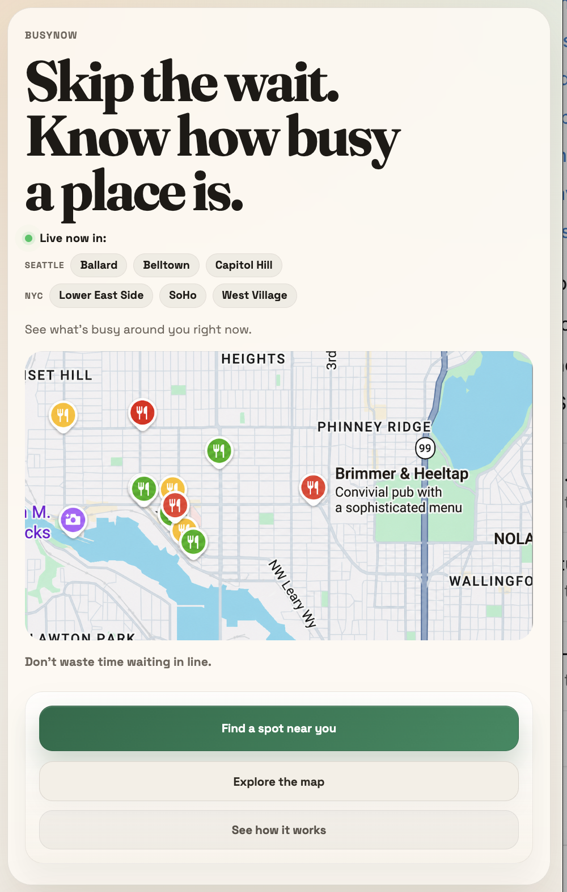
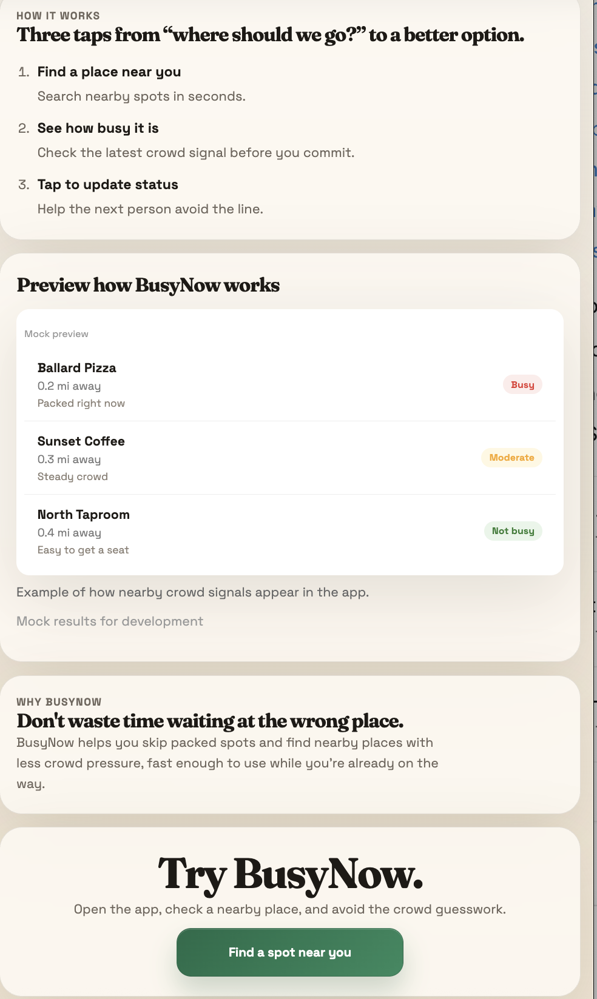
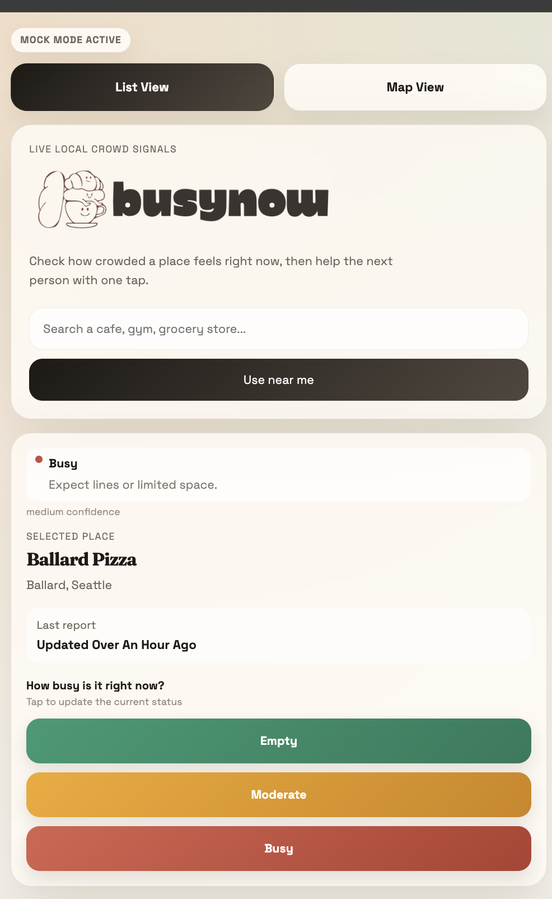
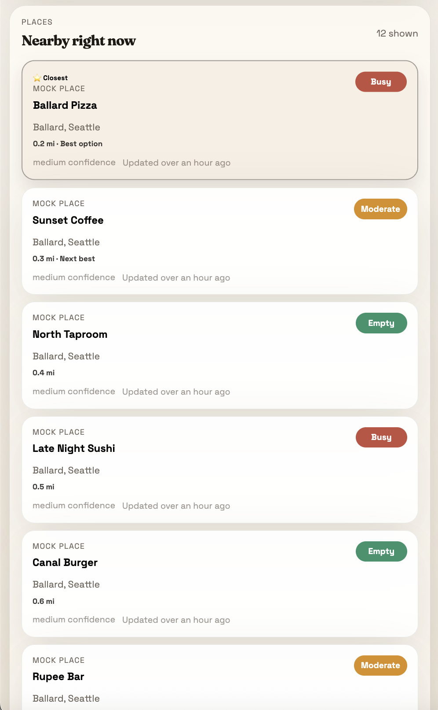
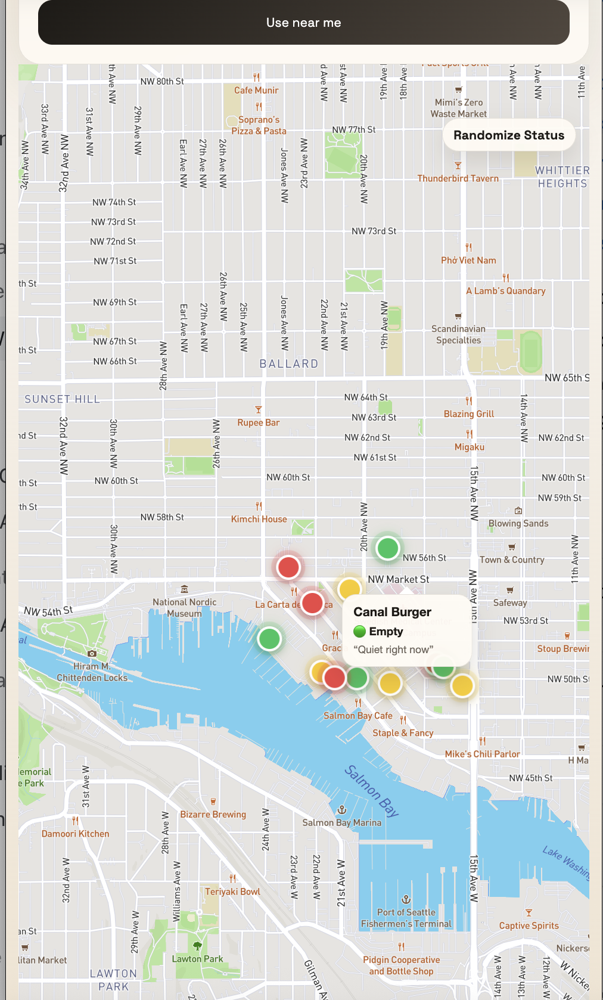

# BusyNow Screenshots

This directory contains public-facing product screenshots used by the repository documentation.

## Product Gallery

The gallery uses deterministic MockMode data to present repeatable product states without generating paid Google Places traffic or exposing user activity.

### Landing page

Landing page:

### How it works

Product explanation and preview:

### Place detail

Selected-place detail and one-tap update flow:

### List view

Nearby places list:

### Map view

Nearby places map:

## Historical Product Milestone

- `api-go-live-day-one-april-2026.png` records the first public API milestone and is retained as product history

## Tips

- Prefer clean browser screenshots with no local file paths or private tabs visible
- Redact any secrets, internal hostnames, or AWS account details
- Use consistent widths so the README looks polished
- If you add screenshots to the public repo, reference them from the public `README.md`
- Keep architecture diagrams in `architecture.md` so the current system has one documented source of truth
